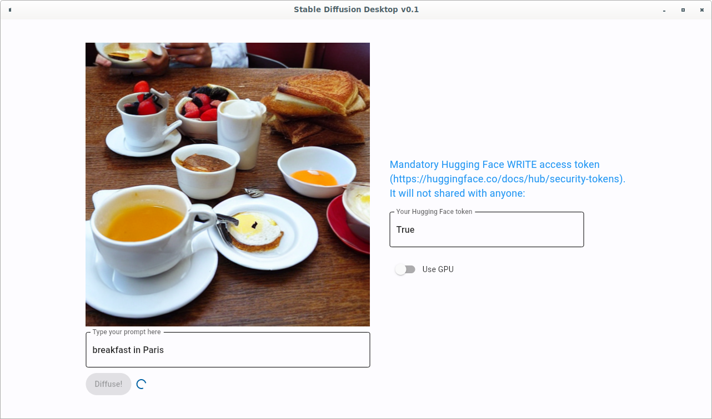

# Stable Diffusion Desktop

## Overview
Stable diffusion model has been made available on [Hugging Face spaces](https://huggingface.co/spaces/stabilityai/stable-diffusion), which is nice. But sometimes the queue is long and you are in a hurry, so this desktop app is built. You can use it to run stable diffusion using your own GPU (or even just CPU) without writing any code. Obviously, if you are a developer, you really don't need this since the Hugging Face Diffuser library is so simple to use.

## Setup
1. You will need to provide a valid [Hugging Face token with WRITE access](https://huggingface.co/docs/hub/security-tokens). This is required by Hugging Face and the token will not be shared with anyone. 
2. For Windows, you will need to enable [Developer mode](https://docs.microsoft.com/en-us/windows/apps/get-started/enable-your-device-for-development). The easiest way to do this is to go to Settings -> For Developers and enable 'Developer mode'. Windows will download a bunch of files.

## Limitations
PyInstaller requires building on each target platform separately (no cross-compiling is possible). Windows build is done on a virtual machine without access to GPU, so no CUDA libraries are bundled. Thus, no GPU support at the moment. It would be helpful if someone using Windows with GPU can help do the Windows build.

## Implementation
The app is written with [Flet](https://flet.dev/) for simplicity and packaged with PyInstaller.

## FAQ
1. Why is it so slow when I run it the first time?

This is because Stable Diffusion needs to download a bunch of large model files. Once that is done, it's much faster.

2. Why is the executable so large?

This is because PyInstaller has to bundle everything into a single executable. There are a lot of dependencies.